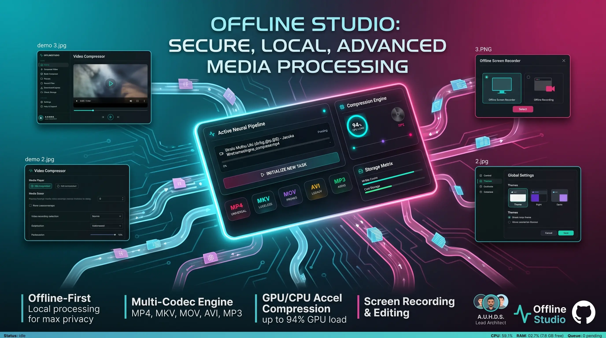

# Offline Studio

A 100% offline desktop video compressor built with React, Electron, and a Python (FFmpeg) engine.



## Features
- **100% Offline**: Process your videos securely on your own machine without relying on cloud services.
- **Modern Interface**: A sleek, user-friendly UI built with React and Vite.
- **Customizable Themes**: Multiple built-in themes to match your preference.

## Prerequisites

To run this application locally, you will need:
- **Node.js**: Version 18.0.0 or higher.
- **Python**: Version 3.8 or higher.
- **FFmpeg**: Installed and added to your system's Environment Variables (`PATH`).

## Local Development Setup

1. Install dependencies:
   ```bash
   npm install
   ```
2. Start the development environment (concurrently starts Vite and Electron):
   ```bash
   npm run electron:dev
   ```

## Packaging for Production

To create a standalone desktop executable without requiring Python on the end user's machine:

1. **Package the Python Engine**:
   ```bash
   pip install pyinstaller
   pyinstaller --onefile --distpath backend/dist/app_engine backend/app_engine.py
   ```
2. **Package the Desktop App**:
   ```bash
   npm run package
   ```
   This command compiles the React frontend and packages the entire app (including the compiled Python backend) using Electron Builder. The output executable will be placed in the `release/` folder.

## Optional: Bundling FFmpeg
To make the application completely self-contained, you can bundle a static `ffmpeg` binary. Please see the local documentation or source code comments in `backend/app_engine.py` for instructions on placing it inside a `bin/` directory.
